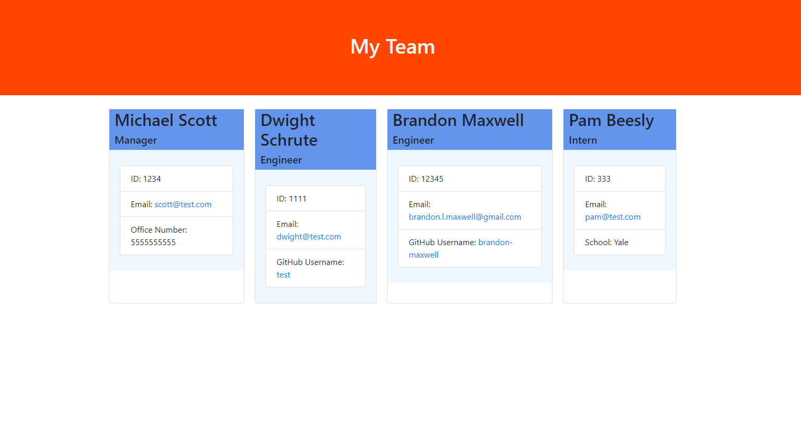

# Team Profile Generator

## Description
This application allows the user to enter their team members information to generate a html file that will display their teams information.

## Preview of Expected Results:

## Tutorial
[Click here to view a tutorial video on how to use the Team Profile Generator](https://www.youtube.com/watch?v=f48_6aB-gSk)

## Table of Contents
* [Intallation](#installation)
* [Usage](#usage)
* [License](#license)
* [Contributing](#contributing)
* [Tests](#tests)
* [Questions](#questions)

## Installation
To install necessary dependencies, run the following command:
~~~
npm i
~~~

## Usage
NOTE: Enter the team members name in the order you want them to appear on the HTML

## License 
This project is licensed under the [The Unlicense](http://unlicense.org/) license.

## Contributing
When contributing to this repository, Fork the repo on GitHub, Clone the project to your machine, Commit changes to your own branch, Push your work back up to your fork, then Submit a pull request so your changes can be reviewed.

## Tests
To run tests, run the following command:
~~~
npm run test
~~~

## Questions
If you have any questions about the repo, open an issue or contact me directly at brandon.l.maxwell@gmail.com. You can find more of my work at [brandon-maxwell](https://github.com/brandon-maxwell).
